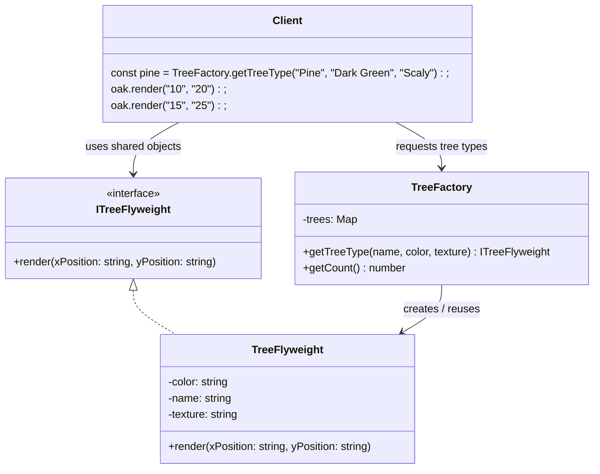

# Typescript Speed Template

When we have a huge number of similar objects, instead of creating many duplicate objects, we share common data and keep only the unique parts separate

 

```mermaid
classDiagram
    class ITreeFlyweight {
        <<interface>>
        +render(xPosition: string, yPosition: string)
    }

    class TreeFlyweight {
        -color: string
        -name: string
        -texture: string
        +render(xPosition: string, yPosition: string)
    }

    class TreeFactory {
        -trees: Map
        +getTreeType(name, color, texture) ITreeFlyweight
        +getCount() number
    }

    ITreeFlyweight <|.. TreeFlyweight
    TreeFactory --> TreeFlyweight : creates / reuses

    class Client {
        const pine = TreeFactory.getTreeType("Pine", "Dark Green", "Scaly");
        oak.render("10", "20");
        oak.render("15", "25");
    }

    Client --> TreeFactory : requests tree types
    Client --> ITreeFlyweight : uses shared objects
```
